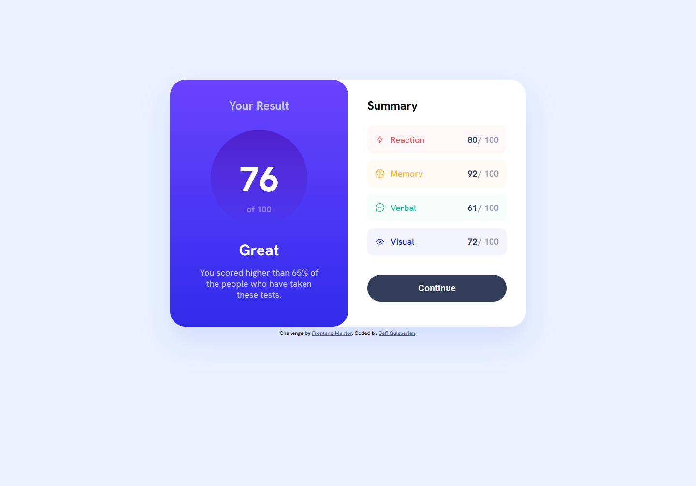
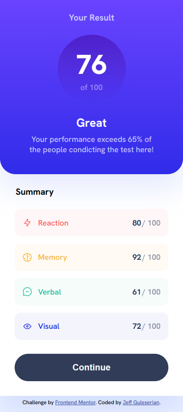
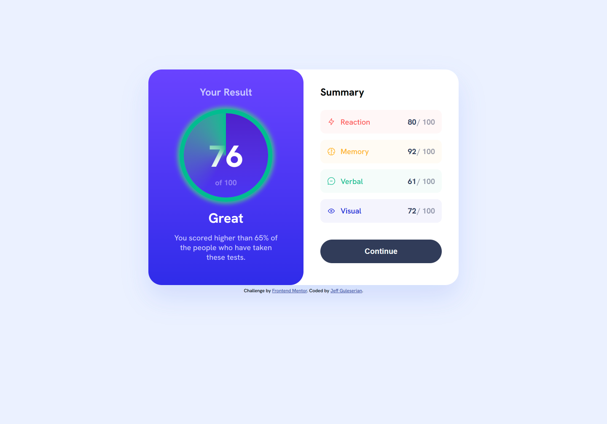

# Frontend Mentor - Results summary component solution

This is a solution to the [Results summary component challenge on Frontend Mentor](https://www.frontendmentor.io/challenges/results-summary-component-CE_K6s0maV). Frontend Mentor challenges help you improve your coding skills by building realistic projects. 

## Table of contents

- [Overview](#overview)
  - [The challenge](#the-challenge)
  - [Screenshot](#screenshot)
  - [Links](#links)
- [My process](#my-process)
  - [Built with](#built-with)
  - [What I learned](#what-i-learned)
  - [Continued development](#continued-development)
  - [Useful resources](#useful-resources)
- [Author](#author)

## Overview+

The Results Summary Component is an interface that reports the results of 4 tests, the user's average score, and feedback regarding how the user scored in comparison with others who have taken the same battery of tests.

### The challenge

**Frontend Mentor Challenges:**
Users should be able to:

- View the optimal layout for the interface depending on their device's screen size
- See hover and focus states for all interactive elements on the page
- Additional: a .json file giving test names and score results was supplied to have the component updated dynamically

**Personal Challenges:**
In addition to the Frentend Mentor challenges, I also wanted to practice some additional, advanced skills.
- Use JavaScript to generate new scores on the fly
- Use jQuery to replace the old scores with new ones, including the average of those scores
- Use jQuery to replace the feedback text to the user
- Use jQuery and CSS to create an animation effect to simulate a "calculating" of new scores
- Research and practice a new method of organizing my CSS stylesheet. In this case, i chose GPS (Global, Page, Section);

### Screenshot

### Links

- Solution URL: [GitHub Repository](https://github.com/jguleserian/FMC-ResultsSummaryComponent.git)
- Live Site URL: [Add live site URL here](https://jguleserian.github.io/FMC-ResultsSummaryComponent/)

## My process

The workflow I took on this project is similar to that of my other projects. I spent more time with the JavaScript and jQuery trying to get comfortable with custom animations. While the effect is not perfect, I am happy with the result given the time I spent working on it.

### Built with

- Semantic HTML5 markup
- CSS custom properties
- Flexbox
- CSS Grid
- Mobile-first workflow
- [jQuery](https://jquery.com/) - JS library

### What I learned

I originally chose this project because it looked interesting, was new, and had some potential for practicing JS. The challenge met my expectations and I enjoyed working on getting the timing, spacing, etc. down. Prinamy areas of learning for me were:

- incorporating custom animations with my other JS code
- practicing working with .json files in JavaScript
- CSS: using conical gradients
- Learning a new organizational method for my CSS stylesheet

### Continued development

While there are a lot of areas in which I would like to see myself progress, I think that in the next challenge I will focus on the organizational structure of my stylesheet. 

After it was suggested to me that I look into organizing my stylesheet with BEM (Block, Element, Modifier), a popular methodology, especially for large teams and large projects, the research began. I also looked into OOCSS, another system of organizing descriptors in CSS. However, I quickly became disenamored with both of them for a couple of reasons:
1. The code produced from these systems, especially BEM, is very bulky and cumbersome. In a developer's world, it seems like succinctness and clean, effecient code is the sought-after commodity. BEM tediously violates this by making code longer to write (or read or process), both in CSS and HTML (well, and I guess JS), being redundant, unnecessarily extending code, and for me, not being any easier to read. 
2. I found the BEM system was fastidious, but not intuitive. I am aware of the benefits of BEM, for sure! However, I think this same thing can be accomplished using other systems. While I wasn't always clear on what to call a "block" as opposed to an "element," which I imagine would be confusing to the benighted in any new collaborative group, I can see that it could serve a a way of ensuring nothing is lost to specificity or scope. I just think we can do better.
3. The use of BEM is not as universal as I originally thought. While BEM has its advocates, there is a significant voice of those who rightly want to modify it and others who want to jettison it altogether.

I have settled, at least for now or until collaboration with a large team mandates it, on a system called GPS (Global, Page, Section). See resources below for a reference to it on GitHub. It is intuitive, easy to understand and read, is succinct, works for large projects/groups, and solves the scope and specificity issues.

### Useful resources

- [Jeff Escalante's GPS CSS Methodology](https://github.com/jescalan/gps) - Jeff explains the system and why you might consider it.
- [MDN's "Organizing your CSS"](https://www.example.com) - This article give you the essentials of best practices for organizing CSS. It includes discussions on BEM, OOCSS and other methodologies. More important are the copious other suggestions they make for organizing your stylesheet.

## Author

- Frontend Mentor - [@jguleserian](https://www.frontendmentor.io/profile/jguleserian)
- GitHub - [@jguleserian](https://www.your-site.com)
- LinkedIn - [@jeffguleserian](https://www.linkedin.com/in/jeffguleserian/)
